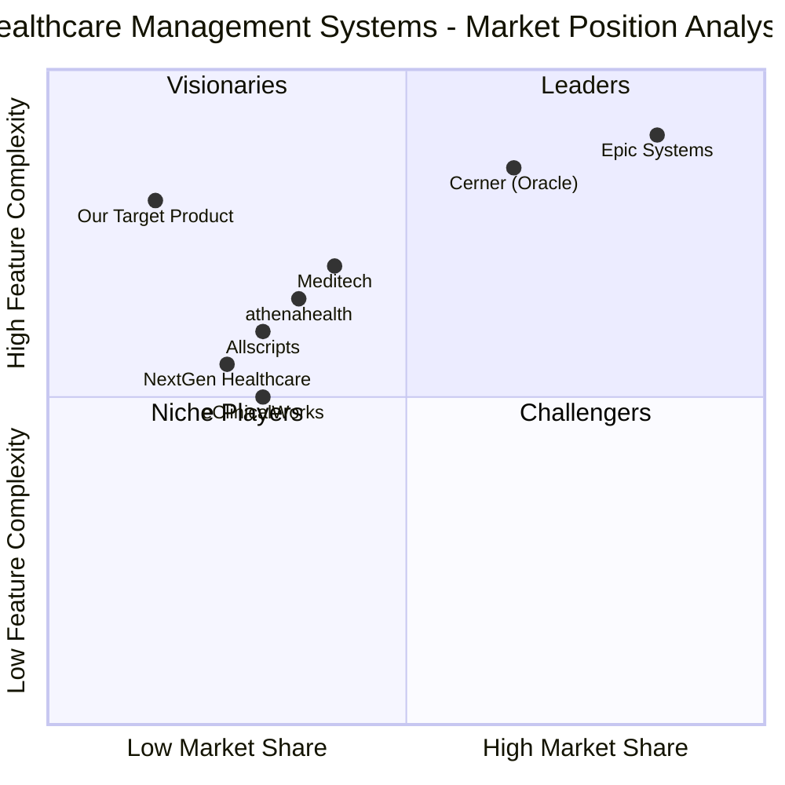

# Multi Hospital Medical System - Product Requirements Document (PRD)

## 1. Project Information

**Language:** English  
**Programming Language:** Shadcn-ui, TypeScript, and Tailwind CSS  
**Project Name:** multi_hospital_medical_system  
**Document Version:** 1.0  
**Date:** June 21, 2025  
**Product Manager:** Emma  

### Original Requirements
Develop a comprehensive, pixel-perfect, high-fidelity, responsive Multi Hospital Medical System web application serving 5 distinct user roles: Patient, Doctor, Hospital Admin, Pharmacy, and Accountant. The system must implement Atomic Design principles with feature-based architecture, ensuring HIPAA/GDPR compliance, accessibility standards (WCAG AA), and modern healthcare workflows including telemedicine, e-prescriptions, emergency management, and comprehensive billing.

---

## 2. Product Definition

### 2.1 Product Goals

1. **Streamline Healthcare Operations**: Create a unified platform that reduces administrative overhead by 40% and improves operational efficiency across all hospital departments through integrated workflows and automated processes.

2. **Enhance Patient Experience**: Deliver exceptional patient care through seamless appointment scheduling, telemedicine capabilities, and real-time access to medical records, achieving a Net Promoter Score (NPS) of 70+ and 95% patient satisfaction.

3. **Ensure Regulatory Compliance & Security**: Maintain 100% HIPAA and GDPR compliance while implementing enterprise-grade security measures, achieving SOC 2 Type II certification and zero security breaches.

### 2.2 User Stories

**As a Patient**, I want to easily schedule appointments with available doctors, access my medical records, and participate in video consultations, so that I can receive convenient, timely healthcare without unnecessary travel or wait times.

**As a Doctor**, I want to manage my patient appointments, access comprehensive medical histories, conduct telemedicine sessions, and create e-prescriptions efficiently, so that I can provide quality care while optimizing my time and reducing administrative burden.

**As a Hospital Administrator**, I want to oversee staff management, coordinate emergency responses, track bed availability, and monitor hospital operations in real-time, so that I can ensure optimal resource utilization and emergency preparedness.

**As a Pharmacy Staff**, I want to receive and process e-prescriptions, manage medication inventory, and track order fulfillment, so that I can provide accurate, timely medication services while maintaining optimal stock levels.

**As an Accountant**, I want to generate invoices, process insurance claims, track revenue streams, and create financial reports, so that I can maintain accurate financial records and optimize the hospital's revenue cycle management.

### 2.3 Competitive Analysis

**Epic Systems**
- *Pros*: Market leader (42.3% share), comprehensive EHR integration, excellent performance and reliability, extensive interoperability through FHIR standards
- *Cons*: High implementation and licensing costs, complex proprietary architecture, steep learning curve, primarily targets large healthcare systems

**Cerner (Oracle Health)**
- *Pros*: Strong market presence (21.7% share), flexible architecture, better third-party integration, Oracle's enterprise backing, CommonWell Health Alliance membership
- *Cons*: Integration complexity, potential stability issues due to open architecture, ongoing Oracle transition challenges

**Allscripts (Veradigm)**
- *Pros*: Focused on small-medium practices, cost-effective solutions, comprehensive practice management, strong interoperability focus
- *Cons*: Limited large-scale enterprise features, reduced market focus after Sunrise product line sale, less comprehensive than Epic/Cerner

**NextGen Healthcare**
- *Pros*: Ambulatory-focused solutions, integrated practice management, specialty-specific workflows, cloud-based offerings
- *Cons*: Limited hospital system capabilities, smaller market share, less comprehensive than enterprise solutions

**athenahealth**
- *Pros*: Cloud-native architecture, strong revenue cycle management, network-based approach, continuous updates
- *Cons*: Limited inpatient capabilities, subscription-based pricing model, dependency on internet connectivity

**Meditech**
- *Pros*: Strong community hospital focus, integrated clinical and financial systems, Expanse web-based platform
- *Cons*: Interface limitations, less modern user experience, smaller ecosystem of third-party integrations

**eClinicalWorks**
- *Pros*: Cost-effective solution, comprehensive ambulatory features, cloud and on-premise options, integrated telehealth
- *Cons*: User interface challenges, limited hospital system features, historical compliance issues

### 2.4 Competitive Quadrant Chart



---

## 3. Market Analysis

### 3.1 Market Size and Growth

The hospital management system market demonstrates exceptional growth potential:

- **Current Market Size (2024)**: USD 25-45.1 billion depending on segment definition
- **Projected Market Size (2030)**: USD 50.3-98.7 billion
- **Compound Annual Growth Rate**: 10.5-17.7% CAGR
- **Telemedicine Segment**: USD 57.6 billion (2024) → USD 505.3 billion (2034) at 24.3% CAGR

### 3.2 Key Market Drivers

**Digital Transformation Acceleration**
- 75% of hospital systems have adopted cloud-based solutions
- AI and machine learning integration revolutionizing predictive analytics
- Government initiatives (HITECH Act, Global Strategy on Digital Health 2020-2025)

**Operational Efficiency Demands**
- Rising healthcare costs requiring streamlined operations
- Regulatory compliance requirements (HIPAA, GDPR)
- Patient safety improvements through error reduction

**Remote Healthcare Expansion**
- Post-pandemic sustained demand for telehealth services
- Rural healthcare access improvements
- Chronic disease management requiring continuous monitoring

### 3.3 Market Segmentation

**By Geography**
- North America: 42-45% market share (dominant region)
- Asia-Pacific: Fastest growing at 9.5% CAGR
- Europe: Strong regulatory compliance drivers

**By Organization Size**
- Large hospitals (500+ beds): Epic and Cerner dominance
- Medium hospitals (100-500 beds): Mixed solutions
- Small practices (<100 beds): Allscripts, NextGen focus

**By Service Type**
- Clinical management: Largest segment at 35% market share
- Administrative management: 28% market share
- Revenue cycle management: 22% market share
- Patient engagement: 15% market share (fastest growing)

### 3.4 Technology Trends

**Artificial Intelligence Integration**
- Predictive analytics for patient outcomes
- Automated clinical decision support
- Intelligent resource allocation

**Interoperability Standards**
- FHIR R4 adoption accelerating
- CommonWell Health Alliance participation
- Cross-platform data exchange capabilities

**Cloud Infrastructure**
- 80% of new implementations choosing cloud-first architecture
- Hybrid cloud solutions for sensitive data
- Multi-tenant SaaS models gaining adoption

---

## 4. User Personas and Journey Mapping

### 4.1 Patient Persona

**Primary Persona: Sarah Mitchell**
- **Age**: 34, Working Mother
- **Location**: Suburban area, 30 minutes from hospital
- **Technology Comfort**: High (smartphone native, uses health apps)
- **Healthcare Needs**: Family primary care, occasional specialist visits, prefers convenience
- **Pain Points**: Long wait times, difficulty scheduling appointments, lack of access to records
- **Goals**: Quick appointment booking, telemedicine options, easy prescription refills, family health management

**Secondary Persona: Robert Chen**
- **Age**: 67, Retired with Chronic Conditions
- **Location**: Urban area, relies on public transport
- **Technology Comfort**: Medium (basic smartphone use, needs simple interfaces)
- **Healthcare Needs**: Regular monitoring, multiple medications, specialist care coordination
- **Pain Points**: Complex appointment scheduling, medication management, transportation challenges
- **Goals**: Simplified access to care, medication reminders, emergency support, clear communication with doctors

**Patient Journey Map**

*Discovery & Registration*
1. Searches for healthcare providers online
2. Compares ratings, specialties, and availability
3. Creates account with identity verification
4. Completes medical history and insurance information

*Appointment Scheduling*
1. Searches available doctors by specialty/location
2. Views real-time calendar availability
3. Selects consultation type (in-person/video/phone)
4. Receives confirmation with preparation instructions

*Pre-Visit Preparation*
1. Receives appointment reminders (48hr, 24hr, 2hr)
2. Completes pre-visit questionnaires
3. Uploads relevant documents or photos
4. Checks insurance coverage and payment options

*Consultation Experience*
1. Checks in via mobile app or kiosk
2. Joins video consultation or visits clinic
3. Discusses symptoms and treatment options
4. Receives care plan and follow-up instructions

*Post-Visit Activities*
1. Accesses visit summary and care plan
2. Receives e-prescriptions automatically sent to pharmacy
3. Schedules follow-up appointments if needed
4. Provides feedback and ratings

### 4.2 Doctor Persona

**Primary Persona: Dr. Maria Rodriguez**
- **Age**: 42, Internal Medicine Specialist
- **Experience**: 15 years clinical practice, hospital-employed
- **Technology Comfort**: High (EMR experienced, early adopter of digital tools)
- **Daily Schedule**: 25-30 patients, mix of in-person and telehealth
- **Pain Points**: Administrative burden, fragmented systems, time pressure
- **Goals**: Efficient patient care, streamlined documentation, work-life balance

**Secondary Persona: Dr. James Thompson**
- **Age**: 58, Emergency Medicine Physician
- **Experience**: 25 years, department head
- **Technology Comfort**: Medium (prefers proven solutions, values reliability)
- **Daily Schedule**: 12-hour shifts, high-acuity cases, team coordination
- **Pain Points**: Information silos, communication delays, staff coordination
- **Goals**: Rapid access to patient data, effective team communication, quality outcomes

**Doctor Journey Map**

*Daily Preparation*
1. Reviews day's schedule and patient list
2. Accesses patient records and history
3. Prepares for complex cases and procedures
4. Coordinates with nursing staff and residents

*Patient Consultation*
1. Accesses comprehensive patient timeline
2. Documents clinical findings and assessments
3. Orders tests, procedures, or referrals
4. Discusses treatment options with patient

*Clinical Decision Making*
1. Reviews lab results and diagnostic imaging
2. Consults medical literature and guidelines
3. Collaborates with specialists via secure messaging
4. Updates treatment plans based on new information

*Documentation & Follow-up*
1. Completes clinical notes with templates
2. Prescribes medications electronically
3. Schedules follow-up appointments
4. Communicates with care team members

### 4.3 Hospital Administrator Persona

**Primary Persona: Jennifer Walsh**
- **Age**: 45, Chief Operating Officer
- **Background**: MBA Healthcare Administration, 20 years hospital management
- **Scope**: 400-bed regional medical center, 2,500 employees
- **Technology Comfort**: High (analytics-driven, strategic technology adoption)
- **Pain Points**: Resource optimization, regulatory compliance, emergency preparedness
- **Goals**: Operational efficiency, patient satisfaction, financial performance, staff retention

**Administrator Journey Map**

*Strategic Planning*
1. Reviews operational dashboards and KPIs
2. Analyzes patient flow and capacity utilization
3. Evaluates staff productivity and satisfaction metrics
4. Plans resource allocation and capital investments

*Daily Operations Management*
1. Monitors bed availability and patient census
2. Coordinates with department heads on staffing
3. Reviews quality metrics and incident reports
4. Manages budget performance and cost controls

*Emergency Response Coordination*
1. Activates emergency protocols and communication
2. Coordinates with EMS and community partners
3. Manages surge capacity and resource deployment
4. Ensures regulatory reporting and documentation

*Performance Analysis*
1. Generates operational and financial reports
2. Analyzes trends and identifies improvement opportunities
3. Presents findings to board and executive team
4. Implements process improvements and policy changes

### 4.4 Pharmacy Staff Persona

**Primary Persona: Michael Park**
- **Age**: 32, Clinical Pharmacist
- **Background**: PharmD, 8 years hospital pharmacy experience
- **Setting**: 300-bed hospital pharmacy, 24/7 operations
- **Technology Comfort**: High (pharmacy informatics, automation systems)
- **Pain Points**: Medication errors, inventory management, workflow interruptions
- **Goals**: Patient safety, medication optimization, efficient dispensing, cost management

**Pharmacy Journey Map**

*Order Processing*
1. Receives e-prescriptions from clinical systems
2. Reviews for drug interactions and allergies
3. Verifies dosing and appropriateness
4. Processes insurance authorization if required

*Medication Preparation*
1. Retrieves medications from automated dispensing
2. Compounds specialized preparations if needed
3. Performs quality checks and labeling
4. Documents preparation and verification steps

*Patient Counseling*
1. Reviews patient medication history
2. Provides medication education and counseling
3. Addresses patient questions and concerns
4. Coordinates with nursing staff on administration

*Inventory Management*
1. Monitors stock levels and expiration dates
2. Places orders for low-stock medications
3. Manages controlled substance accountability
4. Analyzes usage patterns and cost optimization

### 4.5 Accountant Persona

**Primary Persona: Linda Foster**
- **Age**: 48, Revenue Cycle Manager
- **Background**: CPA, 15 years healthcare finance experience
- **Scope**: Multi-specialty practice, $50M annual revenue
- **Technology Comfort**: High (financial systems, analytics tools)
- **Pain Points**: Insurance claim denials, billing complexity, compliance reporting
- **Goals**: Revenue optimization, accurate billing, regulatory compliance, cost control

**Accountant Journey Map**

*Revenue Cycle Management*
1. Reviews daily charges and billing accuracy
2. Processes insurance claims and follow-ups
3. Manages patient payment plans and collections
4. Analyzes denial patterns and appeals process

*Financial Reporting*
1. Generates daily, weekly, and monthly financial reports
2. Analyzes revenue trends and payer mix
3. Tracks key performance indicators (KPIs)
4. Prepares budget variance analysis

*Compliance Management*
1. Ensures billing code accuracy and compliance
2. Manages audit preparation and responses
3. Maintains documentation for regulatory requirements
4. Coordinates with external auditors and consultants

*Strategic Analysis*
1. Analyzes service line profitability
2. Evaluates payer contract performance
3. Identifies revenue enhancement opportunities
4. Supports strategic planning initiatives

---

## 5. Technical Specifications

### 5.1 Requirements Analysis

The Multi Hospital Medical System requires a comprehensive technical architecture that supports:

**Scalability & Performance**
- Support for 10,000+ concurrent users across multiple hospitals
- Sub-second response times for critical operations
- 99.9% uptime with automatic failover capabilities
- Horizontal scaling for peak usage periods

**Security & Compliance**
- End-to-end encryption (AES-256 at rest, TLS 1.3 in transit)
- Multi-factor authentication and role-based access control
- HIPAA and GDPR compliance with audit logging
- SOC 2 Type II certification requirements

**Integration & Interoperability**
- HL7 FHIR R4 standard compliance
- RESTful API architecture with GraphQL support
- Integration with existing EMR/EHR systems
- Third-party service connectivity (labs, imaging, pharmacies)

**Real-time Capabilities**
- WebSocket connections for live updates
- Push notifications for critical alerts
- Real-time video consultation infrastructure
- Live tracking for emergency services

### 5.2 Requirements Pool

#### P0 Requirements (Must-Have)

**Authentication & Authorization**
- MUST implement multi-factor authentication for all user types
- MUST support role-based access control with granular permissions
- MUST provide secure session management with automatic timeout
- MUST integrate with existing hospital Active Directory systems
- MUST maintain comprehensive audit logs for all user actions

**Patient Management**
- MUST provide comprehensive patient registration and profile management
- MUST support appointment scheduling with real-time availability
- MUST enable secure patient-provider messaging
- MUST maintain complete medical history and documentation
- MUST support emergency contact and insurance information management

**Clinical Workflows**
- MUST provide electronic health record (EHR) functionality
- MUST support e-prescription creation and management
- MUST enable lab order management and results viewing
- MUST provide clinical decision support tools
- MUST support care plan creation and tracking

**Telemedicine Platform**
- MUST provide high-quality video consultation capabilities
- MUST support screen sharing and file transfer during consultations
- MUST enable secure chat and messaging during video calls
- MUST record and store consultation sessions securely
- MUST integrate with existing clinical workflows

**Emergency Management**
- MUST provide SOS emergency alert system
- MUST support real-time ambulance tracking and dispatch
- MUST integrate with hospital emergency response protocols
- MUST provide mass casualty incident management
- MUST maintain emergency contact and notification systems

**Billing & Financial Management**
- MUST support comprehensive revenue cycle management
- MUST provide automated insurance claim processing
- MUST enable patient billing and payment processing
- MUST support multiple payment methods and plans
- MUST generate detailed financial reports and analytics

**Pharmacy Integration**
- MUST support e-prescription transmission to pharmacies
- MUST provide medication interaction and allergy checking
- MUST enable inventory management and automated ordering
- MUST support controlled substance tracking and reporting
- MUST integrate with automated dispensing systems

**Compliance & Security**
- MUST maintain HIPAA compliance for all PHI handling
- MUST support GDPR requirements for EU patients
- MUST provide data encryption at rest and in transit
- MUST implement comprehensive backup and disaster recovery
- MUST support regulatory reporting and audit trails

#### P1 Requirements (Should-Have)

**Advanced Analytics**
- SHOULD provide predictive analytics for patient outcomes
- SHOULD support population health management tools
- SHOULD enable custom dashboard creation for different roles
- SHOULD provide automated report generation and distribution
- SHOULD support benchmarking against industry standards

**Mobile Applications**
- SHOULD provide native mobile apps for patients and providers
- SHOULD support offline functionality for critical operations
- SHOULD enable push notifications for important updates
- SHOULD provide location-based services for emergency response
- SHOULD support biometric authentication on mobile devices

**Integration Capabilities**
- SHOULD integrate with major EHR systems (Epic, Cerner, Allscripts)
- SHOULD support HL7 FHIR R4 for seamless data exchange
- SHOULD connect with external lab and imaging systems
- SHOULD integrate with health information exchanges (HIEs)
- SHOULD support third-party application marketplace

**Advanced Communication**
- SHOULD provide multi-language support for diverse populations
- SHOULD enable automated appointment reminders via multiple channels
- SHOULD support patient education content delivery
- SHOULD provide family member access controls and notifications
- SHOULD enable secure communication with external providers

#### P2 Requirements (Nice-to-Have)

**AI & Machine Learning**
- MAY implement AI-powered diagnostic assistance
- MAY provide predictive modeling for resource planning
- MAY support natural language processing for clinical documentation
- MAY enable automated coding and billing optimization
- MAY provide personalized treatment recommendations

**Advanced Features**
- MAY support virtual reality for medical training and patient education
- MAY provide IoT integration for medical device connectivity
- MAY enable blockchain for secure health record sharing
- MAY support genomic data integration and analysis
- MAY provide advanced scheduling optimization algorithms

**Enhanced User Experience**
- MAY provide voice-controlled interfaces for hands-free operation
- MAY support customizable themes and branding per hospital
- MAY enable advanced search and filtering capabilities
- MAY provide automated workflow suggestions based on user behavior
- MAY support social features for patient community building

### 5.3 Architecture & Technology Stack

**Frontend Architecture**
- React 18+ with TypeScript for type safety
- Shadcn-ui component library with Tailwind CSS
- Atomic Design methodology (Atoms → Molecules → Organisms → Templates → Pages)
- Responsive design supporting desktop, tablet, and mobile viewports
- Progressive Web App (PWA) capabilities for offline functionality

**Backend Architecture**
- Node.js with Express.js or Fastify for API development
- Microservices architecture with Docker containerization
- PostgreSQL for primary data storage with Redis for caching
- GraphQL and REST APIs for flexible data access
- Message queuing with RabbitMQ or Apache Kafka

**Real-time Communication**
- WebSocket implementation using Socket.io
- WebRTC for peer-to-peer video consultations
- Push notification service integration
- Real-time database synchronization

**Security & Compliance**
- OAuth 2.0 / OpenID Connect for authentication
- JWT tokens with secure refresh mechanisms
- Rate limiting and DDoS protection
- Regular security audits and penetration testing
- Automated vulnerability scanning

**Infrastructure & DevOps**
- Cloud-native deployment (AWS, Azure, or Google Cloud)
- Kubernetes orchestration for container management
- CI/CD pipelines with automated testing
- Infrastructure as Code (Terraform or CloudFormation)
- Monitoring and logging with ELK stack or similar

### 5.4 UI Design Framework

**Design System Implementation**

*Color Palette*
```css
:root {
  --primary: #0066CC;     /* Primary Blue */
  --secondary: #00A99D;   /* Teal */
  --accent: #FFCC00;      /* Amber */
  --error: #E53E3E;       /* Red */
  --success: #38A169;     /* Green */
  --warning: #DD6B20;     /* Orange */
  --neutral-50: #F9FAFB;
  --neutral-100: #F3F4F6;
  --neutral-500: #6B7280;
  --neutral-900: #111827;
}
```

*Typography Scale*
```css
.text-headline { font-family: 'Inter', sans-serif; font-weight: 700; font-size: 2rem; }
.text-subhead { font-family: 'Inter', sans-serif; font-weight: 500; font-size: 1.5rem; }
.text-body { font-family: 'Roboto', sans-serif; font-weight: 400; font-size: 1rem; }
.text-caption { font-family: 'Roboto', sans-serif; font-weight: 300; font-size: 0.75rem; }
```

*Spacing System*
```css
.space-xs { margin: 0.25rem; }   /* 4px */
.space-sm { margin: 0.5rem; }    /* 8px */
.space-md { margin: 1rem; }      /* 16px */
.space-lg { margin: 1.5rem; }    /* 24px */
.space-xl { margin: 2rem; }      /* 32px */
```

*Component Specifications*
```css
.btn-primary {
  background: var(--primary);
  border-radius: 4px;
  padding: 12px 24px;
  transition: all 0.2s ease;
}

.card {
  background: white;
  border-radius: 8px;
  box-shadow: 0 2px 4px rgba(0,0,0,0.1);
  padding: 24px;
}

.input-field {
  border: 1px solid var(--neutral-300);
  border-radius: 4px;
  padding: 12px 16px;
  font-size: 1rem;
}

.input-field:focus {
  outline: 2px solid var(--primary);
  border-color: var(--primary);
}
```

**Responsive Breakpoints**
```css
/* Mobile First Approach */
@media (min-width: 768px) { /* Tablet */ }
@media (min-width: 1024px) { /* Desktop */ }
@media (min-width: 1440px) { /* Large Desktop */ }
```

**Accessibility Standards**
- WCAG AA compliance (contrast ratio ≥ 4.5:1 for normal text, ≥ 3:1 for large text)
- Focus indicators for keyboard navigation
- ARIA labels and roles for screen readers
- Semantic HTML structure
- Alternative text for images and icons

### 5.5 Data Models & Architecture

**Core Entity Relationships**

*User Management*
```typescript
interface User {
  id: string;
  email: string;
  role: 'patient' | 'doctor' | 'admin' | 'pharmacy' | 'accountant';
  profile: UserProfile;
  permissions: Permission[];
  createdAt: Date;
  updatedAt: Date;
}

interface UserProfile {
  firstName: string;
  lastName: string;
  phone: string;
  avatar?: string;
  preferences: UserPreferences;
}
```

*Patient Data*
```typescript
interface Patient {
  id: string;
  userId: string;
  medicalRecordNumber: string;
  demographics: Demographics;
  insurance: InsuranceInfo[];
  emergencyContacts: EmergencyContact[];
  medicalHistory: MedicalHistory;
  appointments: Appointment[];
  prescriptions: Prescription[];
}

interface MedicalHistory {
  allergies: Allergy[];
  medications: Medication[];
  conditions: MedicalCondition[];
  procedures: Procedure[];
  labResults: LabResult[];
}
```

*Clinical Data*
```typescript
interface Appointment {
  id: string;
  patientId: string;
  doctorId: string;
  type: 'in-person' | 'video' | 'phone';
  status: 'scheduled' | 'in-progress' | 'completed' | 'cancelled';
  scheduledTime: Date;
  duration: number;
  notes?: string;
  consultation?: ConsultationRecord;
}

interface ConsultationRecord {
  id: string;
  appointmentId: string;
  chiefComplaint: string;
  assessment: string;
  plan: string;
  prescriptions: Prescription[];
  followUpRequired: boolean;
  recordingUrl?: string;
}
```

### 5.6 Open Questions

**Technical Architecture**
1. Should we implement a microservices architecture from the start, or begin with a modular monolith and evolve to microservices as we scale?
2. What is the preferred cloud provider (AWS, Azure, Google Cloud) and do we have existing enterprise agreements?
3. How should we handle data migration from existing hospital systems during implementation?

**Integration Requirements**
1. Which specific EMR/EHR systems need priority integration support?
2. Are there existing hospital APIs or data formats that must be supported?
3. What is the timeline for third-party integrations (labs, imaging, pharmacies)?

**Compliance & Security**
1. Do different hospital locations have varying compliance requirements beyond HIPAA/GDPR?
2. What specific audit and reporting requirements must be supported?
3. Are there existing security protocols or SSO systems that must be integrated?

**Performance & Scaling**
1. What are the expected peak concurrent user loads for different hospital sizes?
2. Are there specific geographic regions that require data residency compliance?
3. What are the acceptable downtime windows for maintenance and updates?

**User Experience**
1. Should the system support multiple languages beyond English, and which languages are priority?
2. Are there specific accessibility requirements beyond WCAG AA?
3. What level of customization should be available for different hospital branding?

**Financial & Business Model**
1. Will this be licensed as SaaS, on-premise, or hybrid deployment?
2. What is the expected pricing model (per user, per hospital, per feature)?
3. Are there specific ROI metrics that hospitals will use to evaluate success?

---

## 6. Feature Specifications

### 6.1 Authentication & User Management

**Multi-Factor Authentication (MFA)**
- Primary authentication: Email/username + password
- Secondary factors: SMS OTP, authenticator app (TOTP), biometric (mobile)
- Backup codes for account recovery
- Risk-based authentication for suspicious login attempts

**Role-Based Access Control (RBAC)**
- Granular permissions system with inheritance
- Dynamic role assignment based on context (e.g., on-call status)
- Temporary privilege escalation for emergencies
- Audit trail for all permission changes

**Single Sign-On (SSO)**
- SAML 2.0 and OAuth 2.0/OIDC support
- Integration with hospital Active Directory/LDAP
- Seamless access across multiple hospital systems
- Session management with configurable timeout policies

### 6.2 Patient Portal & Engagement

**Patient Registration & Onboarding**
- Multi-step registration with progress indicators
- Identity verification through multiple methods
- Insurance card scanning and OCR processing
- Medical history questionnaire with smart branching logic

**Appointment Scheduling System**
- Real-time provider availability calendar
- Multi-location and multi-specialty search and filtering
- Appointment type selection (in-person, video, phone)
- Automated conflict detection and resolution
- Waitlist management with automatic notifications
- Integration with provider scheduling systems

**Patient Dashboard**
- Personalized health summary and key metrics
- Upcoming appointments and recent activity timeline
- Quick action buttons for common tasks
- Health reminders and educational content
- Family member access controls for pediatric and elderly patients

**Medical Records Access**
- Comprehensive health record viewer with timeline view
- Lab results with trend analysis and normal range indicators
- Imaging results with DICOM viewer integration
- Prescription history with refill status tracking
- Visit summaries and care plan documents
- Secure document upload for patient-provided records

### 6.3 Provider Clinical Workflows

**Electronic Health Records (EHR)**
- Comprehensive patient chart with customizable views
- Clinical decision support with evidence-based alerts
- Smart templates and auto-completion for documentation
- Problem list management with ICD-10 coding assistance
- Care plan creation with goal tracking and outcomes measurement

**E-Prescribing System**
- Integrated medication database with drug interaction checking
- Formulary compliance checking with alternative suggestions
- Prior authorization workflow automation
- Prescription history review with adherence tracking
- Controlled substance prescribing with DEA compliance
- Electronic transmission to patient's preferred pharmacy

**Clinical Documentation**
- Voice-to-text dictation with medical vocabulary recognition
- Smart phrases and macros for common documentation
- Structured data entry with coded values
- Progress note templates by specialty and visit type
- Clinical photography integration with annotation tools

**Order Management**
- Laboratory order sets with indication-based recommendations
- Radiology ordering with clinical decision support
- Referral management with specialist matching
- Procedure scheduling integration
- Results notification and follow-up tracking

### 6.4 Telemedicine Platform

**Video Consultation Engine**
- High-definition video with adaptive bitrate streaming
- Screen sharing for document review and education
- Multi-participant calls for family consultations
- Recording capabilities with patient consent management
- Virtual waiting room with queue management

**Consultation Tools**
- Integrated chat for text communication during calls
- File sharing for documents, images, and reports
- Digital whiteboard for patient education
- Virtual examination tools (digital stethoscope integration)
- Real-time vital signs monitoring device integration

**Technical Infrastructure**
- WebRTC for peer-to-peer communication
- HIPAA-compliant video infrastructure
- Mobile app support for iOS and Android
- Bandwidth optimization for low-connectivity areas
- Integration with existing clinical workflows

### 6.5 Emergency Management System

**SOS Emergency Alert**
- One-touch emergency activation button
- GPS location tracking with indoor positioning
- Automatic emergency contact notification
- Integration with hospital emergency response team
- Escalation protocols based on response time

**Ambulance Dispatch & Tracking**
- Real-time vehicle location tracking
- Dynamic route optimization with traffic data
- ETA calculations with automatic updates
- Communication system between dispatch, crew, and hospital
- Incident documentation and reporting

**Emergency Department Integration**
- Bed availability tracking and management
- Patient acuity assessment and triage protocols
- Resource allocation and staff notification
- Mass casualty incident coordination
- Integration with regional emergency management systems

**Crisis Communication**
- Multi-channel notification system (SMS, email, app push)
- Hospital-wide emergency announcements
- Staff recall and scheduling adjustments
- External agency coordination and reporting
- Social media integration for public communications

### 6.6 Pharmacy Management

**Prescription Processing Workflow**
- Electronic prescription receipt and validation
- Drug utilization review with clinical alerts
- Insurance verification and prior authorization
- Medication therapy management recommendations
- Prescription fulfillment tracking and notifications

**Inventory Management System**
- Automated inventory tracking with barcode scanning
- Expiration date monitoring with automated alerts
- Automated reordering based on usage patterns
- Controlled substance tracking and DEA reporting
- Vendor management and purchase order automation

**Clinical Pharmacy Services**
- Medication reconciliation workflows
- Pharmacokinetic dosing calculators
- Drug interaction screening and management
- Patient counseling documentation
- Pharmaceutical care plan development

**Automated Dispensing Integration**
- Interface with robotic dispensing systems
- Medication cart filling and restocking
- Unit dose preparation and labeling
- Quality assurance and error reduction protocols
- Workflow optimization and efficiency metrics

### 6.7 Financial Management & Billing

**Revenue Cycle Management**
- Patient registration and insurance verification
- Charge capture and coding assistance
- Claims generation and electronic submission
- Payment posting and reconciliation
- Denial management and appeals process

**Patient Billing & Collections**
- Itemized billing with transparent pricing
- Multiple payment options (credit card, ACH, payment plans)
- Patient financial counseling and assistance programs
- Automated payment reminders and collection workflows
- Bad debt management and write-off procedures

**Insurance & Claims Processing**
- Real-time eligibility verification
- Prior authorization workflow management
- Claims scrubbing and error prevention
- Electronic remittance advice processing
- Performance analytics and denial trending

**Financial Reporting & Analytics**
- Real-time revenue dashboards and KPI monitoring
- Accounts receivable aging and collection metrics
- Payer performance analysis and contract evaluation
- Service line profitability analysis
- Budget planning and variance reporting

### 6.8 Administrative Management

**Staff Directory & Management**
- Comprehensive staff profiles with credentials tracking
- Role-based permissions and access control
- License and certification expiration monitoring
- Performance evaluation and goal tracking
- Continuing education requirements management

**Facility & Resource Management**
- Bed management with real-time availability
- Equipment tracking and maintenance scheduling
- Room scheduling and utilization optimization
- Supply chain management and procurement
- Environmental services coordination

**Scheduling & Workforce Management**
- Provider scheduling with coverage requirements
- Shift management and time tracking
- Call schedule management and notifications
- Staffing level optimization and forecasting
- Integration with payroll and HR systems

**Quality & Compliance Management**
- Incident reporting and root cause analysis
- Quality metrics tracking and benchmarking
- Regulatory compliance monitoring and reporting
- Policy and procedure management
- Audit trail and documentation management

---

## 7. Compliance & Security Requirements

### 7.1 HIPAA Compliance Framework

**Privacy Rule Implementation**
- Minimum necessary standard for PHI access and disclosure
- Patient rights management (access, amendment, accounting of disclosures)
- Business associate agreement management and oversight
- Privacy impact assessments for new features and integrations
- Privacy officer designation and staff training programs

**Security Rule Technical Safeguards**
- Access control with unique user identification and authentication
- Audit controls with comprehensive logging and monitoring
- Integrity controls to prevent unauthorized PHI alteration
- Person or entity authentication with multi-factor requirements
- Transmission security with end-to-end encryption

**Security Rule Administrative Safeguards**
- Security officer designation and information security program
- Workforce training and access management procedures
- Information access management with role-based controls
- Security awareness and training programs
- Security incident procedures and response protocols

**Security Rule Physical Safeguards**
- Facility access controls and workstation security
- Device and media controls for portable devices
- Workstation use restrictions and monitoring
- Media disposal and reuse procedures
- Physical access logging and audit trails

**Breach Notification Compliance**
- Automated breach detection and classification systems
- Risk assessment protocols for potential breaches
- Notification procedures (60-day HHS reporting, patient notification)
- Documentation and record-keeping requirements
- Third-party breach notification coordination

### 7.2 GDPR Compliance Framework

**Lawful Basis for Processing**
- Consent management with granular opt-in/opt-out controls
- Legitimate interest assessments and documentation
- Vital interest processing for emergency medical situations
- Public task processing for public health requirements
- Legal obligation compliance for regulatory reporting

**Data Subject Rights Implementation**
- Right of access with automated data export capabilities
- Right to rectification with audit trail maintenance
- Right to erasure ("right to be forgotten") with legal override options
- Right to restrict processing with automated workflow controls
- Right to data portability with structured data formats
- Right to object with easy opt-out mechanisms

**Data Protection by Design and Default**
- Privacy impact assessments for all new features
- Data minimization principles in system design
- Purpose limitation enforcement in data collection
- Storage limitation with automated data retention policies
- Accuracy maintenance with data quality controls
- Security and confidentiality by default settings

**International Data Transfers**
- Adequacy decision compliance for data transfers
- Standard contractual clauses implementation
- Binding corporate rules for multinational organizations
- Certification and code of conduct adherence
- Transfer impact assessments and safeguards

### 7.3 Additional Healthcare Compliance Standards

**SOX Compliance (for Public Companies)**
- Financial reporting controls and audit trails
- Change management procedures for financial systems
- Access controls and segregation of duties
- Management assessment and external audit requirements

**HITECH Act Requirements**
- Enhanced HIPAA enforcement and penalty structures
- Breach notification expansion and requirements
- Business associate liability and compliance obligations
- Meaningful use incentives and EHR adoption requirements

**FDA Regulations (for Medical Device Integration)**
- Medical device software classification and compliance
- Quality management system requirements (ISO 13485)
- Clinical evaluation and post-market surveillance
- Cybersecurity requirements for networked devices

**State and Local Regulations**
- Medical license verification and tracking
- State-specific privacy and security requirements
- Public health reporting obligations
- Professional liability and malpractice insurance requirements

### 7.4 Security Architecture & Controls

**Identity and Access Management (IAM)**
- Centralized identity provider with federation capabilities
- Multi-factor authentication with risk-based assessment
- Privileged access management with just-in-time access
- Identity lifecycle management with automated provisioning/deprovisioning
- Single sign-on with session management and timeout controls

**Data Protection & Encryption**
- AES-256 encryption for data at rest with key rotation
- TLS 1.3 for data in transit with certificate management
- Database-level encryption with transparent data encryption
- Application-level encryption for sensitive fields
- Key management system with hardware security modules

**Network Security**
- Network segmentation with micro-segmentation capabilities
- Web application firewall with OWASP Top 10 protection
- Intrusion detection and prevention systems
- DDoS protection with traffic analysis and mitigation
- VPN access for remote users with device compliance checking

**Application Security**
- Secure software development lifecycle (SSDLC)
- Static and dynamic application security testing
- Dependency scanning and vulnerability management
- Code review and security testing automation
- Runtime application self-protection (RASP)

**Monitoring & Incident Response**
- Security information and event management (SIEM)
- User and entity behavior analytics (UEBA)
- Automated threat detection and response
- Incident response procedures and playbooks
- Forensic capabilities and evidence preservation

### 7.5 Audit & Compliance Monitoring

**Audit Logging Requirements**
- Comprehensive audit trail for all PHI access and modifications
- User activity logging with session tracking and correlation
- System event logging with security event prioritization
- Log retention policies with automated archival and disposal
- Log integrity protection with digital signatures and tamper detection

**Compliance Monitoring Tools**
- Automated compliance scanning and assessment
- Policy violation detection and alerting
- Risk assessment automation with scoring and trending
- Regulatory reporting automation and submission
- Compliance dashboard with real-time status monitoring

**Third-Party Risk Management**
- Vendor risk assessment and ongoing monitoring
- Business associate agreement management and tracking
- Third-party security assessment and certification requirements
- Supply chain security and software composition analysis
- Incident notification and response coordination with vendors

---

## 8. Success Metrics & KPIs

### 8.1 Clinical Quality Metrics

**Patient Safety Indicators**
- Medication error reduction: Target 50% reduction from baseline
- Patient identification errors: <0.1% of all patient encounters
- Clinical decision support alert override rate: <15% for high-severity alerts
- Time to critical test result notification: <30 minutes for urgent results
- Patient safety incident reporting increase: 25% increase indicating improved culture

**Care Quality Measures**
- Patient satisfaction scores: Maintain >90% satisfaction rating
- Care plan adherence rate: >85% of patients following prescribed care plans
- Preventive care compliance: 90% of eligible patients receiving recommended screenings
- Chronic disease management effectiveness: 80% of patients meeting clinical targets
- Patient engagement in care decisions: 95% of patients reporting involvement in treatment planning

**Clinical Efficiency Metrics**
- Average appointment scheduling time: <2 minutes for online scheduling
- Provider documentation time: Reduce by 30% through smart templates and voice recognition
- Clinical decision-making time: 20% reduction through integrated clinical decision support
- Test result turnaround time: 95% of routine results available within 24 hours
- Medication reconciliation accuracy: >99% accuracy with automated systems

### 8.2 Operational Excellence KPIs

**System Performance Metrics**
- System uptime: Maintain 99.9% availability (8.77 hours downtime per year maximum)
- Page load times: <2 seconds for 95% of page loads
- API response times: <500ms for 99% of API calls
- Mobile app crash rate: <0.1% of sessions
- Concurrent user capacity: Support 10,000+ simultaneous users without degradation

**User Adoption & Engagement**
- User adoption rate: 90% of target users actively using the system within 6 months
- Feature utilization rate: 70% of available features used by target user groups
- Mobile app engagement: 60% of patients using mobile app for appointment management
- Telemedicine adoption: 40% of eligible appointments conducted via video consultation
- Self-service usage: 80% of appointment scheduling done through patient portal

**Administrative Efficiency**
- Administrative task reduction: 40% reduction in manual administrative tasks
- Staff productivity improvement: 25% increase in tasks completed per FTE
- Paper reduction: 90% reduction in paper-based processes
- Process automation: 70% of routine processes fully automated
- Training time reduction: 50% reduction in new user training time

### 8.3 Financial Performance Indicators

**Revenue Cycle Metrics**
- Days in accounts receivable: Reduce to <45 days (industry benchmark: 50+ days)
- First-pass claim approval rate: Achieve >95% clean claim rate
- Denial rate: Maintain <5% initial denial rate
- Collection rate: Achieve >98% collection rate for patient accounts
- Revenue cycle length: Reduce total cycle time by 30%

**Cost Management KPIs**
- IT operational costs: 20% reduction in total cost of ownership
- Staff overtime reduction: 25% reduction through improved scheduling efficiency
- Supply chain optimization: 15% reduction in medical supply costs through better inventory management
- Energy consumption: 10% reduction through smart facility management
- Print and paper costs: 80% reduction through digital transformation

**Return on Investment (ROI)**
- Overall system ROI: Achieve positive ROI within 18 months of implementation
- Labor cost savings: $500,000 annually through workflow automation
- Error reduction savings: $200,000 annually through reduced medical errors
- Efficiency gains: $300,000 annually through improved operational efficiency
- Compliance cost avoidance: $100,000 annually through automated compliance management

### 8.4 Patient Experience Metrics

**Access & Convenience**
- Appointment availability: Same-day appointments available for 80% of urgent requests
- Average wait time for appointments: <15 minutes from scheduled time
- Online appointment booking success rate: >95% successful bookings without assistance
- Patient portal usage: 75% of patients actively using portal within 6 months
- Mobile app rating: Maintain >4.5 stars in app stores

**Communication & Engagement**
- Patient-provider communication satisfaction: >90% satisfaction with digital communication tools
- Response time to patient messages: <24 hours for non-urgent communications, <2 hours for urgent
- Patient education engagement: 60% of patients accessing educational materials provided
- Medication adherence improvement: 20% improvement through digital reminders and education
- Care coordination satisfaction: >85% of patients satisfied with care team coordination

**Health Outcomes**
- Chronic disease management: 15% improvement in clinical outcomes for chronic conditions
- Preventive care participation: 25% increase in preventive screening completion
- Hospital readmission rates: 20% reduction in 30-day readmissions
- Emergency department visits: 10% reduction in non-urgent ED visits
- Patient activation measure: 30% improvement in patient activation scores

### 8.5 Security & Compliance Metrics

**Security Performance**
- Security incident response time: <1 hour for critical incidents, <4 hours for high severity
- Vulnerability remediation: 100% of critical vulnerabilities patched within 24 hours
- Security training completion: 100% of staff completing annual security training
- Password compliance: 95% of users following strong password policies
- Multi-factor authentication adoption: 100% for administrative users, 90% for clinical users

**Compliance Adherence**
- HIPAA audit findings: Zero significant findings in annual compliance audits
- Data breach incidents: Target of zero breaches affecting >500 individuals
- Business associate agreement compliance: 100% of vendors with executed BAAs
- Audit trail completeness: 100% of required activities logged and retained
- Privacy training completion: 100% of workforce completing annual privacy training

**Data Quality & Integrity**
- Data accuracy rate: >99.5% for critical patient data elements
- Data completeness: >95% completion for required clinical documentation
- Interoperability success rate: >98% successful data exchange with external systems
- Backup and recovery testing: 100% successful quarterly disaster recovery tests
- Data retention compliance: 100% adherence to legal and regulatory retention requirements

### 8.6 Innovation & Growth Metrics

**Technology Advancement**
- Feature release velocity: Deploy new features every 2 weeks with agile methodology
- API usage growth: 50% annual increase in third-party integrations
- AI/ML model accuracy: >90% accuracy for predictive models and clinical decision support
- User feedback incorporation: 80% of user-requested features evaluated and 40% implemented
- Technology stack modernization: 90% of legacy systems replaced or integrated within 2 years

**Market Position & Expansion**
- Market share growth: 25% annual increase in hospital client base
- Customer retention rate: >95% annual client retention
- Referral rate: 60% of new clients acquired through existing client referrals
- Geographic expansion: Enter 3 new regional markets annually
- Competitive differentiation: Maintain top 3 position in independent analyst reports

**Research & Development**
- R&D investment: Maintain 15% of revenue invested in product development
- Patent applications: File 5+ patent applications annually for innovative features
- Academic partnerships: Establish 3+ university research collaborations
- Clinical study participation: Support 2+ clinical effectiveness studies annually
- Industry recognition: Receive 3+ industry awards for innovation and excellence

---

## 9. Implementation Roadmap & Timeline

### 9.1 Project Phases Overview

**Phase 1: Foundation & Core Platform (Months 1-6)**
- Core infrastructure setup and security implementation
- User authentication and role-based access control
- Basic patient and provider portals
- Fundamental clinical workflows (EHR, basic scheduling)
- HIPAA compliance framework implementation

**Phase 2: Clinical Features & Integration (Months 7-12)**
- Advanced EHR functionality and clinical decision support
- E-prescribing system with pharmacy integration
- Telemedicine platform with video consultation capabilities
- Laboratory and imaging system integrations
- Mobile application development and deployment

**Phase 3: Advanced Features & Analytics (Months 13-18)**
- Emergency management and SOS system
- Advanced analytics and reporting capabilities
- AI-powered clinical decision support
- Revenue cycle management and billing automation
- Third-party ecosystem integrations

**Phase 4: Optimization & Scale (Months 19-24)**
- Performance optimization and scalability enhancements
- Advanced workflow automation and AI features
- Multi-hospital deployment and configuration management
- Advanced security features and compliance automation
- Continuous improvement based on user feedback

### 9.2 Detailed Implementation Timeline

**Months 1-2: Project Initiation & Architecture**
- Technical architecture design and review
- Development environment setup and CI/CD pipeline
- Security framework implementation (encryption, authentication)
- Database design and initial data models
- API architecture and documentation standards

**Months 3-4: Core User Management & Authentication**
- Multi-factor authentication system
- Role-based access control implementation
- User registration and profile management
- Single sign-on integration capabilities
- Basic administrative interfaces

**Months 5-6: Patient Portal & Basic Scheduling**
- Patient registration and profile management
- Basic appointment scheduling system
- Provider directory and search functionality
- Patient dashboard and basic health records access
- Mobile-responsive design implementation

**Months 7-8: Provider Clinical Workflows**
- Electronic health record (EHR) core functionality
- Clinical documentation tools and templates
- Basic clinical decision support alerts
- Provider scheduling and calendar management
- Patient-provider secure messaging

**Months 9-10: E-Prescribing & Pharmacy Integration**
- Electronic prescribing system development
- Drug interaction and allergy checking
- Pharmacy integration and prescription transmission
- Medication history and reconciliation tools
- Controlled substance prescribing compliance

**Months 11-12: Telemedicine Platform**
- Video consultation infrastructure setup
- WebRTC implementation for peer-to-peer communication
- Virtual waiting room and appointment management
- Screen sharing and file transfer capabilities
- Mobile app integration for telemedicine

**Months 13-14: Emergency Management System**
- SOS emergency alert system development
- GPS tracking and location services
- Ambulance dispatch and tracking integration
- Emergency response workflow automation
- Integration with hospital emergency protocols

**Months 15-16: Financial Management & Billing**
- Revenue cycle management implementation
- Insurance verification and claims processing
- Patient billing and payment processing
- Financial reporting and analytics dashboards
- Integration with existing hospital financial systems

**Months 17-18: Advanced Analytics & AI Features**
- Predictive analytics for patient outcomes
- Clinical decision support AI implementation
- Population health management tools
- Advanced reporting and dashboard creation
- Machine learning model development and deployment

**Months 19-20: Multi-Hospital Deployment & Configuration**
- Multi-tenant architecture implementation
- Hospital-specific configuration management
- Data migration tools and procedures
- Backup and disaster recovery implementation
- Performance monitoring and optimization

**Months 21-22: Integration Ecosystem & API Platform**
- Third-party integration marketplace development
- HL7 FHIR API implementation
- EMR/EHR system integration templates
- Medical device integration capabilities
- Webhook and event-driven architecture

**Months 23-24: Go-Live Support & Optimization**
- User training and adoption programs
- Performance tuning and scalability testing
- Security audits and compliance verification
- User feedback integration and system refinements
- Production support and monitoring setup

### 9.3 Resource Requirements

**Development Team Structure**
- Project Manager (1 FTE for 24 months)
- Technical Lead/Architect (1 FTE for 24 months)
- Senior Full-Stack Developers (4 FTE for 24 months)
- Frontend Specialists (2 FTE for 18 months)
- Backend/API Developers (3 FTE for 20 months)
- Mobile App Developers (2 FTE for 12 months)
- DevOps Engineers (2 FTE for 24 months)
- Quality Assurance Engineers (3 FTE for 20 months)
- UI/UX Designers (2 FTE for 18 months)
- Security Specialists (1 FTE for 24 months)
- Healthcare Domain Experts (2 FTE for 24 months)

**Infrastructure & Technology Costs**
- Cloud infrastructure: $50,000-$100,000 annually
- Third-party services and APIs: $30,000-$60,000 annually
- Development tools and licenses: $20,000-$40,000 annually
- Security and compliance tools: $40,000-$80,000 annually
- Testing and quality assurance tools: $15,000-$30,000 annually

### 9.4 Risk Management & Mitigation

**Technical Risks**
- *Risk*: Integration complexity with existing hospital systems
- *Mitigation*: Early proof-of-concept development, dedicated integration team, phased rollout approach

- *Risk*: Scalability challenges with high user volumes
- *Mitigation*: Performance testing throughout development, cloud-native architecture, load testing automation

- *Risk*: Security vulnerabilities and compliance failures
- *Mitigation*: Security-first development approach, regular penetration testing, compliance audits

**Regulatory Risks**
- *Risk*: HIPAA/GDPR compliance violations
- *Mitigation*: Legal consultation, compliance officer involvement, automated compliance monitoring

- *Risk*: Changing healthcare regulations
- *Mitigation*: Flexible architecture design, regulatory monitoring, quick response capabilities

**Business Risks**
- *Risk*: User adoption challenges
- *Mitigation*: User-centered design, extensive training programs, change management support

- *Risk*: Competitive pressure and market changes
- *Mitigation*: Continuous market research, agile development approach, rapid feature deployment

### 9.5 Success Criteria & Go-Live Readiness

**Technical Readiness Criteria**
- System uptime >99.5% during testing period
- Page load times <2 seconds for 95% of requests
- Support for 1,000+ concurrent users without performance degradation
- Zero critical security vulnerabilities
- 100% HIPAA compliance audit checklist completion

**User Readiness Criteria**
- 90% of pilot users successfully complete core workflows
- User satisfaction rating >85% in pre-launch testing
- Training completion rate >95% for all user groups
- Support ticket resolution time <4 hours average
- User acceptance testing sign-off from all stakeholder groups

**Business Readiness Criteria**
- Integration testing completed with all critical third-party systems
- Data migration procedures validated and tested
- Disaster recovery and business continuity plans approved
- Legal and compliance sign-off on all regulatory requirements
- Go-live support team trained and ready for 24/7 coverage

---

## 10. Conclusion & Next Steps

### 10.1 Executive Summary

The Multi Hospital Medical System represents a comprehensive, next-generation healthcare management platform designed to address the evolving needs of modern healthcare organizations. With the healthcare IT market growing at 10.5-17.7% CAGR and telemedicine expanding at 24.3% annually, this system positions our organization to capture significant market share while delivering exceptional value to healthcare providers and patients.

**Key Differentiators:**
- **Unified Platform**: Unlike competitors who offer fragmented solutions, our system provides integrated workflows across all hospital departments
- **Modern Architecture**: Cloud-native, mobile-first design with advanced security and compliance built-in
- **Patient-Centric Design**: Superior user experience with 70+ NPS target and 95% patient satisfaction goals
- **AI-Powered Intelligence**: Advanced analytics and clinical decision support capabilities
- **Regulatory Excellence**: 100% HIPAA/GDPR compliance with SOC 2 Type II certification

### 10.2 Expected Business Impact

**Quantified Benefits:**
- 40% reduction in administrative overhead through workflow automation
- 30% improvement in provider productivity through smart documentation and decision support
- 50% reduction in medication errors through integrated e-prescribing and clinical alerts
- 25% increase in patient satisfaction through improved access and communication
- 20% improvement in revenue cycle efficiency through automated billing and claims processing

**Market Opportunity:**
- Total Addressable Market: $50.3-98.7 billion by 2030
- Target Market Segment: Small to medium hospitals (100-500 beds) currently underserved by Epic/Cerner
- Competitive Advantage: Modern technology stack with 50% lower total cost of ownership
- Growth Potential: 25% annual client base growth with 95% retention target

### 10.3 Investment Requirements

**Development Investment:**
- Total 24-month development cost: $4.5-6.0 million
- Team size: 25-30 professionals across development, design, and domain expertise
- Infrastructure and tooling: $200,000-400,000 annually
- Regulatory and compliance: $100,000-200,000 for certifications and audits

**Expected ROI:**
- Break-even: 18 months post-launch
- 3-year revenue projection: $15-25 million
- Market valuation potential: $100-200 million within 5 years
- Customer lifetime value: $500,000-1,000,000 per hospital client

### 10.4 Critical Success Factors

**Technical Excellence**
- Maintain 99.9% system uptime and <2 second response times
- Achieve zero security breaches and 100% compliance audit success
- Deliver seamless integration with existing hospital systems
- Ensure scalability to support 10,000+ concurrent users

**User Adoption & Satisfaction**
- Achieve 90% user adoption within 6 months of deployment
- Maintain >4.5 star ratings in app stores and >90% user satisfaction
- Provide exceptional customer support with <4 hour response times
- Deliver continuous value through regular feature updates and improvements

**Market Positioning**
- Establish thought leadership through industry partnerships and publications
- Build strong channel partner network for sales and implementation
- Achieve recognition in industry analyst reports (Gartner, KLAS)
- Develop compelling case studies demonstrating quantified customer benefits

### 10.5 Immediate Next Steps

**Phase 1: Project Initiation (Next 30 Days)**
1. **Stakeholder Alignment**: Conduct executive review and secure final budget approval
2. **Team Assembly**: Recruit key technical leadership and core development team
3. **Vendor Selection**: Choose cloud infrastructure provider and key technology partners
4. **Legal Framework**: Establish data processing agreements and compliance frameworks
5. **Project Kickoff**: Initiate project management processes and communication channels

**Phase 2: Foundation Development (Days 31-90)**
1. **Technical Architecture**: Finalize system architecture and technology stack decisions
2. **Security Framework**: Implement core security controls and compliance monitoring
3. **Development Environment**: Establish CI/CD pipelines and development workflows
4. **Design System**: Create comprehensive UI/UX design system and component library
5. **Prototype Development**: Build proof-of-concept for core user workflows

**Phase 3: Core Development (Days 91-180)**
1. **Authentication System**: Complete multi-factor authentication and RBAC implementation
2. **Patient Portal**: Launch beta version of patient registration and scheduling
3. **Provider Tools**: Develop basic EHR functionality and clinical documentation
4. **Integration Testing**: Begin integration with pilot hospital systems
5. **Compliance Validation**: Conduct initial HIPAA compliance assessment and remediation

### 10.6 Long-Term Vision

**Year 1-2: Market Entry & Validation**
- Successfully deploy in 5-10 pilot hospitals
- Achieve product-market fit with validated customer success metrics
- Build core feature set with high user satisfaction and adoption
- Establish compliance credentials and security certifications

**Year 3-5: Market Expansion & Scale**
- Expand to 50-100 hospital clients across multiple geographic regions
- Develop advanced AI and analytics capabilities
- Build ecosystem of integrated third-party solutions
- Establish market leadership in mid-market hospital segment

**Year 5+: Industry Transformation**
- Become the preferred platform for next-generation healthcare delivery
- Lead industry standards for interoperability and patient engagement
- Expand internationally with localized compliance and features
- Drive healthcare innovation through research partnerships and data insights

### 10.7 Final Recommendation

The Multi Hospital Medical System represents a significant opportunity to address critical gaps in the healthcare technology market while delivering measurable value to healthcare providers and patients. With the right investment, team, and execution, this platform can capture substantial market share and drive meaningful improvements in healthcare delivery.

**Recommendation: Proceed with full development initiative** based on:
- Strong market demand and growth trajectory
- Clear competitive differentiation and value proposition
- Achievable technical requirements with proven technologies
- Positive financial projections and ROI potential
- Alignment with industry trends toward integrated, patient-centric care

The success of this initiative requires commitment to excellence in execution, continuous focus on user needs, and unwavering dedication to security and compliance. With these elements in place, the Multi Hospital Medical System can become a transformative force in healthcare technology.

---

**Document Status:** Complete  
**Next Review Date:** 30 days from approval  
**Document Owner:** Product Management Team  
**Stakeholder Sign-off Required:** Executive Team, Engineering Leadership, Compliance Officer  

*This PRD serves as the foundational document for the Multi Hospital Medical System development initiative. All implementation decisions should align with the requirements, goals, and success criteria outlined in this document.*
