# Multi Hospital Medical System - System Design

## Implementation Approach

The Multi Hospital Medical System will be implemented using a modern microservices architecture to support scalability, maintainability, and independent deployment of different system components. The system addresses several complex requirements:

**Difficult Points Analysis:**
- **Multi-tenant Architecture**: Supporting multiple hospitals with isolated data and customizable workflows
- **Real-time Communication**: Video consultations, emergency alerts, and live updates across 10,000+ concurrent users
- **HIPAA/GDPR Compliance**: End-to-end encryption, audit logging, and strict access controls
- **Integration Complexity**: HL7 FHIR, EMR systems, pharmacy networks, and medical devices
- **High Availability**: 99.9% uptime requirement with automatic failover

**Selected Open-Source Framework Stack:**
- **Frontend**: React 18+ with TypeScript, Shadcn-ui, Tailwind CSS
- **Backend**: Node.js with Express.js/Fastify for microservices
- **Database**: PostgreSQL (primary), Redis (caching), MongoDB (document storage)
- **Message Queue**: Apache Kafka for event streaming, Redis for real-time messaging
- **Container Orchestration**: Kubernetes with Docker containers
- **API Gateway**: Kong or Traefik for routing and security
- **Real-time Communication**: Socket.io for WebSocket, WebRTC for video calls
- **Search Engine**: Elasticsearch for clinical data search
- **Monitoring**: Prometheus + Grafana, ELK stack for logging
- **Security**: OAuth 2.0/OpenID Connect, HashiCorp Vault for secrets

**Architecture Patterns:**
- Event-driven architecture for loose coupling
- CQRS (Command Query Responsibility Segregation) for complex clinical data
- Saga pattern for distributed transactions
- Circuit breaker pattern for resilience
- API Gateway pattern for centralized security and routing

## Data Structures and Interfaces

```mermaid
classDiagram
    %% Core User Management
    class User {
        +string id
        +string email
        +string passwordHash
        +UserRole role
        +UserProfile profile
        +Permission[] permissions
        +DateTime createdAt
        +DateTime updatedAt
        +bool isActive
        +string tenantId
        +login(email: string, password: string) AuthToken
        +updateProfile(profile: UserProfile) void
        +resetPassword(token: string, newPassword: string) void
        +enableMFA() void
    }

    class UserProfile {
        +string firstName
        +string lastName
        +string phone
        +string avatar
        +Address address
        +Preferences preferences
        +validateProfile() bool
        +updateAvatar(file: File) string
    }

    class Permission {
        +string id
        +string resource
        +string action
        +string[] conditions
        +DateTime expiresAt
        +checkAccess(resource: string, action: string) bool
    }

    %% Patient Management
    class Patient {
        +string id
        +string userId
        +string medicalRecordNumber
        +Demographics demographics
        +InsuranceInfo[] insurance
        +EmergencyContact[] emergencyContacts
        +MedicalHistory medicalHistory
        +Appointment[] appointments
        +Prescription[] prescriptions
        +registerPatient(userData: UserData) Patient
        +updateInsurance(insurance: InsuranceInfo) void
        +addEmergencyContact(contact: EmergencyContact) void
        +getMedicalTimeline() MedicalEvent[]
    }

    class MedicalHistory {
        +Allergy[] allergies
        +Medication[] medications
        +MedicalCondition[] conditions
        +Procedure[] procedures
        +LabResult[] labResults
        +VitalSigns[] vitalSigns
        +addCondition(condition: MedicalCondition) void
        +updateAllergies(allergies: Allergy[]) void
        +getConditionHistory(conditionId: string) MedicalCondition[]
    }

    %% Clinical Workflows
    class Appointment {
        +string id
        +string patientId
        +string doctorId
        +AppointmentType type
        +AppointmentStatus status
        +DateTime scheduledTime
        +int duration
        +string notes
        +ConsultationRecord consultation
        +scheduleAppointment(patientId: string, doctorId: string, time: DateTime) Appointment
        +reschedule(newTime: DateTime) void
        +cancel(reason: string) void
        +startConsultation() ConsultationRecord
        +completeAppointment(notes: string) void
    }

    class ConsultationRecord {
        +string id
        +string appointmentId
        +string chiefComplaint
        +string assessment
        +string treatmentPlan
        +Prescription[] prescriptions
        +FollowUp[] followUps
        +string recordingUrl
        +bool followUpRequired
        +createRecord(appointmentId: string) ConsultationRecord
        +addPrescription(prescription: Prescription) void
        +scheduleFollowUp(followUp: FollowUp) void
        +generateSummary() string
    }

    %% Doctor/Provider Management
    class Doctor {
        +string id
        +string userId
        +string licenseNumber
        +Specialty[] specialties
        +Schedule schedule
        +Department department
        +Credential[] credentials
        +Patient[] patients
        +updateSchedule(schedule: Schedule) void
        +addSpecialty(specialty: Specialty) void
        +getPatientList() Patient[]
        +createPrescription(patientId: string, medication: Medication) Prescription
    }

    class Schedule {
        +string id
        +string doctorId
        +TimeSlot[] availableSlots
        +TimeSlot[] bookedSlots
        +WorkingHours workingHours
        +bool isActive
        +addAvailability(startTime: DateTime, endTime: DateTime) void
        +bookSlot(slotId: string, appointmentId: string) void
        +getAvailableSlots(date: Date) TimeSlot[]
        +blockTime(startTime: DateTime, endTime: DateTime, reason: string) void
    }

    %% Prescription & Pharmacy
    class Prescription {
        +string id
        +string patientId
        +string doctorId
        +Medication medication
        +Dosage dosage
        +int quantity
        +int refills
        +PrescriptionStatus status
        +string pharmacyId
        +DateTime prescribedDate
        +DateTime expirationDate
        +createPrescription(patientId: string, medication: Medication) Prescription
        +sendToPharmacy(pharmacyId: string) void
        +checkInteractions() DrugInteraction[]
        +authorize() void
        +refill() Prescription
    }

    class Medication {
        +string id
        +string name
        +string genericName
        +string ndc
        +string strength
        +string form
        +string[] contraindications
        +DrugInteraction[] interactions
        +validateDosage(dosage: Dosage, patient: Patient) bool
        +checkAllergies(patient: Patient) bool
        +getAlternatives() Medication[]
    }

    class Pharmacy {
        +string id
        +string name
        +Address address
        +string phone
        +Inventory inventory
        +Prescription[] prescriptions
        +processPrescription(prescription: Prescription) void
        +updateInventory(medication: Medication, quantity: int) void
        +checkAvailability(medication: Medication) bool
        +orderMedication(medication: Medication, quantity: int) void
    }

    %% Emergency Management
    class EmergencyAlert {
        +string id
        +string patientId
        +AlertType type
        +AlertSeverity severity
        +Location location
        +DateTime timestamp
        +AlertStatus status
        +string[] respondersNotified
        +EmergencyResponse response
        +triggerAlert(patientId: string, location: Location) EmergencyAlert
        +dispatchAmbulance(ambulanceId: string) void
        +updateStatus(status: AlertStatus) void
        +notifyHospital() void
    }

    class Ambulance {
        +string id
        +string vehicleNumber
        +Crew[] crew
        +Location currentLocation
        +AmbulanceStatus status
        +Equipment[] equipment
        +EmergencyAlert currentAlert
        +dispatch(alert: EmergencyAlert) void
        +updateLocation(location: Location) void
        +arriveAtScene() void
        +transportToHospital(hospitalId: string) void
    }

    %% Hospital Administration
    class Hospital {
        +string id
        +string name
        +Address address
        +Facility[] facilities
        +Department[] departments
        +Staff[] staff
        +Bed[] beds
        +Equipment[] equipment
        +addDepartment(department: Department) void
        +manageBeds() BedStatus[]
        +getStaffSchedule() Schedule[]
        +generateReports() Report[]
    }

    class Bed {
        +string id
        +string roomNumber
        +BedType type
        +BedStatus status
        +string patientId
        +Department department
        +Equipment[] attachedEquipment
        +assignPatient(patientId: string) void
        +discharge() void
        +clean() void
        +maintenance() void
    }

    %% Financial Management
    class Bill {
        +string id
        +string patientId
        +BillItem[] items
        +decimal totalAmount
        +decimal paidAmount
        +decimal balanceAmount
        +BillStatus status
        +InsuranceClaim[] claims
        +Payment[] payments
        +generateBill(patientId: string, services: Service[]) Bill
        +addItem(item: BillItem) void
        +processPayment(payment: Payment) void
        +submitInsuranceClaim(insuranceId: string) InsuranceClaim
    }

    class Payment {
        +string id
        +string billId
        +decimal amount
        +PaymentMethod method
        +PaymentStatus status
        +DateTime transactionDate
        +string transactionId
        +processPayment(amount: decimal, method: PaymentMethod) Payment
        +refund(amount: decimal) void
        +getReceipt() Receipt
    }

    %% Telemedicine
    class VideoConsultation {
        +string id
        +string appointmentId
        +string sessionId
        +Participant[] participants
        +ConsultationStatus status
        +DateTime startTime
        +DateTime endTime
        +string recordingUrl
        +ChatMessage[] chatMessages
        +startSession() string
        +addParticipant(userId: string) void
        +shareScreen() void
        +sendMessage(message: string) void
        +endSession() void
        +saveRecording() string
    }

    %% Integration Services
    class HL7Service {
        +processMessage(message: HL7Message) void
        +generateADT(patient: Patient) HL7Message
        +generateORM(order: Order) HL7Message
        +generateORU(result: LabResult) HL7Message
        +validateMessage(message: HL7Message) bool
        +transformToFHIR(hl7Message: HL7Message) FHIRResource
    }

    class FHIRService {
        +createResource(resource: FHIRResource) string
        +getResource(id: string, type: string) FHIRResource
        +updateResource(id: string, resource: FHIRResource) void
        +searchResources(criteria: SearchCriteria) FHIRResource[]
        +validateResource(resource: FHIRResource) bool
    }

    %% Audit and Compliance
    class AuditLog {
        +string id
        +string userId
        +string action
        +string resource
        +DateTime timestamp
        +string ipAddress
        +string userAgent
        +AuditDetails details
        +logAccess(userId: string, resource: string) void
        +logModification(userId: string, resource: string, changes: object) void
        +generateReport(startDate: Date, endDate: Date) AuditReport
    }

    %% Relationships
    User ||--|| UserProfile : has
    User ||--o{ Permission : has
    Patient ||--|| User : extends
    Doctor ||--|| User : extends
    Patient ||--|| MedicalHistory : has
    Patient ||--o{ Appointment : schedules
    Doctor ||--o{ Appointment : accepts
    Appointment ||--o| ConsultationRecord : generates
    Doctor ||--|| Schedule : has
    Prescription }o--|| Patient : prescribed_to
    Prescription }o--|| Doctor : prescribed_by
    Prescription }o--|| Medication : contains
    Pharmacy ||--o{ Prescription : processes
    EmergencyAlert ||--o| Ambulance : dispatches
    Hospital ||--o{ Department : contains
    Hospital ||--o{ Bed : manages
    Patient ||--o{ Bill : generates
    Bill ||--o{ Payment : receives
    Appointment ||--o| VideoConsultation : may_have
    VideoConsultation ||--o{ Participant : includes
```

## Program Call Flow

```mermaid
sequenceDiagram
    participant P as Patient
    participant PW as PatientWebApp
    participant AG as APIGateway
    participant AUTH as AuthService
    participant PS as PatientService
    participant AS as AppointmentService
    participant DS as DoctorService
    participant NS as NotificationService
    participant VS as VideoService
    participant PRES as PrescriptionService
    participant PHAR as PharmacyService
    participant ES as EmergencyService
    participant AMB as AmbulanceService
    participant BS as BillingService
    participant AUDIT as AuditService
    participant DB as Database
    participant CACHE as RedisCache
    participant QUEUE as MessageQueue

    %% User Authentication Flow
    Note over P, AUDIT: User Authentication & Registration
    P->>PW: Open application
    PW->>AG: GET /api/auth/session
    AG->>AUTH: validateSession()
    AUTH-->>AG: session invalid
    AG-->>PW: 401 Unauthorized
    PW->>AG: POST /api/auth/login {email, password}
    AG->>AUTH: login(email, password)
    AUTH->>DB: SELECT user WHERE email=?
    DB-->>AUTH: user data
    AUTH->>AUTH: validatePassword()
    AUTH->>AUTH: generateMFAChallenge()
    AUTH-->>AG: MFA challenge required
    AG-->>PW: MFA challenge
    P->>PW: Enter MFA code
    PW->>AG: POST /api/auth/mfa {code}
    AG->>AUTH: validateMFA(code)
    AUTH->>AUTH: generateJWT()
    AUTH->>CACHE: store session
    AUTH->>AUDIT: logAccess(userId, 'login')
    AUTH-->>AG: JWT token
    AG-->>PW: authentication success

    %% Patient Registration Flow
    Note over P, AUDIT: Patient Registration
    P->>PW: Click "Register as Patient"
    PW->>AG: POST /api/patients/register {userData}
    AG->>AUTH: validateToken()
    AUTH-->>AG: token valid
    AG->>PS: createPatient(userData)
    PS->>PS: validatePatientData()
    PS->>DB: INSERT INTO patients
    PS->>DB: INSERT INTO medical_history
    PS->>QUEUE: publish patientCreated event
    PS->>AUDIT: logCreation(userId, 'patient')
    PS-->>AG: patient created
    AG-->>PW: registration success
    QUEUE->>NS: consume patientCreated
    NS->>NS: sendWelcomeEmail()

    %% Appointment Scheduling Flow
    Note over P, AUDIT: Appointment Scheduling
    P->>PW: Search for doctors
    PW->>AG: GET /api/doctors/search?specialty=cardiology
    AG->>DS: searchDoctors(specialty)
    DS->>CACHE: get cached results
    CACHE-->>DS: cache miss
    DS->>DB: SELECT doctors WHERE specialty=?
    DS->>CACHE: cache results
    DS-->>AG: doctor list
    AG-->>PW: available doctors
    
    P->>PW: Select doctor and time
    PW->>AG: GET /api/doctors/{id}/availability
    AG->>DS: getDoctorAvailability(doctorId)
    DS->>DB: SELECT schedule WHERE doctor_id=?
    DS->>AS: getBookedSlots(doctorId)
    AS->>DB: SELECT appointments WHERE doctor_id=?
    AS-->>DS: booked slots
    DS-->>AG: available slots
    AG-->>PW: time slots
    
    P->>PW: Book appointment
    PW->>AG: POST /api/appointments {doctorId, patientId, time}
    AG->>AS: createAppointment()
    AS->>AS: validateTimeSlot()
    AS->>DB: BEGIN TRANSACTION
    AS->>DB: INSERT INTO appointments
    AS->>DS: updateDoctorSchedule()
    DS->>DB: UPDATE doctor_schedule
    AS->>DB: COMMIT TRANSACTION
    AS->>QUEUE: publish appointmentScheduled
    AS->>AUDIT: logCreation(userId, 'appointment')
    AS-->>AG: appointment created
    AG-->>PW: booking confirmation
    
    QUEUE->>NS: consume appointmentScheduled
    NS->>NS: sendConfirmationEmail()
    NS->>NS: scheduleReminders()

    %% Video Consultation Flow
    Note over P, AUDIT: Video Consultation
    P->>PW: Join video consultation
    PW->>AG: POST /api/video/join/{appointmentId}
    AG->>AS: validateAppointment(appointmentId)
    AS->>DB: SELECT appointment WHERE id=?
    AS-->>AG: appointment valid
    AG->>VS: createVideoSession(appointmentId)
    VS->>VS: generateSessionToken()
    VS->>DB: INSERT INTO video_sessions
    VS->>CACHE: store session data
    VS-->>AG: session token
    AG-->>PW: video session details
    
    PW->>VS: Connect to WebRTC
    VS->>VS: establishPeerConnection()
    Note over VS: Doctor joins session
    VS->>AS: startConsultation(appointmentId)
    AS->>DB: UPDATE appointment SET status='in-progress'
    AS->>AUDIT: logAccess(userId, 'consultation_start')
    
    Note over P, VS: Video call in progress
    P->>VS: Send chat message
    VS->>VS: broadcastMessage()
    VS->>DB: INSERT INTO chat_messages
    
    Note over VS: Consultation ends
    VS->>AS: endConsultation(appointmentId, notes)
    AS->>DB: UPDATE appointment SET status='completed'
    AS->>DB: INSERT INTO consultation_records
    AS->>AUDIT: logModification(userId, 'consultation_end')
    VS->>VS: saveRecording()
    VS-->>PW: consultation ended

    %% E-Prescription Flow
    Note over P, AUDIT: E-Prescription
    Note over DS: Doctor creates prescription during consultation
    DS->>PRES: createPrescription(patientId, medication)
    PRES->>PRES: checkDrugInteractions()
    PRES->>PRES: validateDosage()
    PRES->>DB: INSERT INTO prescriptions
    PRES->>QUEUE: publish prescriptionCreated
    PRES->>AUDIT: logCreation(doctorId, 'prescription')
    PRES-->>DS: prescription created
    
    QUEUE->>PHAR: consume prescriptionCreated
    PHAR->>PHAR: processPrescription()
    PHAR->>DB: INSERT INTO pharmacy_queue
    PHAR->>NS: notifyPatient()
    NS->>P: SMS notification
    
    P->>PW: View prescriptions
    PW->>AG: GET /api/prescriptions
    AG->>PRES: getPatientPrescriptions(patientId)
    PRES->>DB: SELECT prescriptions WHERE patient_id=?
    PRES-->>AG: prescription list
    AG-->>PW: prescriptions

    %% Emergency Alert Flow
    Note over P, AUDIT: Emergency Alert System
    P->>PW: Press SOS button
    PW->>AG: POST /api/emergency/alert {location}
    AG->>ES: triggerEmergencyAlert(patientId, location)
    ES->>DB: INSERT INTO emergency_alerts
    ES->>QUEUE: publish emergencyAlert (high priority)
    ES->>NS: notifyEmergencyContacts()
    ES->>AMB: dispatchAmbulance(location)
    ES->>AUDIT: logEmergency(patientId, 'sos_triggered')
    ES-->>AG: alert created
    AG-->>PW: emergency services notified
    
    QUEUE->>AMB: consume emergencyAlert
    AMB->>AMB: findNearestAmbulance(location)
    AMB->>DB: UPDATE ambulance SET status='dispatched'
    AMB->>ES: updateAlertStatus('dispatched')
    ES->>DB: UPDATE emergency_alerts
    ES->>NS: notifyPatient('ambulance_dispatched')
    
    AMB->>AMB: updateLocation() [continuous]
    AMB->>ES: locationUpdate()
    ES->>CACHE: update location
    ES->>PW: realtime location update
    
    AMB->>ES: arriveAtScene()
    ES->>DB: UPDATE emergency_alerts SET status='on_scene'
    ES->>NS: notifyHospital('patient_pickup')
    ES->>AUDIT: logEvent('ambulance_arrived')

    %% Billing Flow
    Note over P, AUDIT: Billing and Payment
    Note over AS: After appointment completion
    AS->>QUEUE: publish appointmentCompleted
    QUEUE->>BS: consume appointmentCompleted
    BS->>BS: generateBill(appointmentId)
    BS->>DB: INSERT INTO bills
    BS->>DB: INSERT INTO bill_items
    BS->>QUEUE: publish billGenerated
    BS->>AUDIT: logCreation(userId, 'bill')
    
    QUEUE->>NS: consume billGenerated
    NS->>P: Email bill notification
    
    P->>PW: View and pay bill
    PW->>AG: GET /api/bills/{patientId}
    AG->>BS: getPatientBills(patientId)
    BS->>DB: SELECT bills WHERE patient_id=?
    BS-->>AG: bill list
    AG-->>PW: bills
    
    P->>PW: Make payment
    PW->>AG: POST /api/payments {billId, amount, method}
    AG->>BS: processPayment(billId, amount, method)
    BS->>BS: validatePayment()
    BS->>DB: INSERT INTO payments
    BS->>DB: UPDATE bills SET paid_amount=?
    BS->>QUEUE: publish paymentProcessed
    BS->>AUDIT: logPayment(patientId, amount)
    BS-->>AG: payment success
    AG-->>PW: payment confirmation
    
    QUEUE->>NS: consume paymentProcessed
    NS->>P: Payment receipt email

    %% System Maintenance and Monitoring
    Note over AUDIT: Continuous Audit Logging
    loop Every User Action
        AUDIT->>DB: INSERT INTO audit_logs
        AUDIT->>CACHE: update user activity
    end
    
    Note over CACHE: Cache Management
    loop Every 5 minutes
        CACHE->>CACHE: cleanup expired sessions
        CACHE->>DB: sync critical data
    end
    
    Note over QUEUE: Message Queue Processing
    loop Continuous
        QUEUE->>QUEUE: process pending messages
        QUEUE->>QUEUE: handle failed messages
        QUEUE->>QUEUE: update message status
    end
```



## Anything UNCLEAR

Several aspects require clarification for optimal implementation:

**Integration Specifications:**
- Which specific EMR/EHR systems require priority integration (Epic, Cerner, Allscripts)?
- Are there existing hospital APIs or preferred data exchange formats?
- What are the specific HL7 message types and versions that must be supported?

**Deployment and Infrastructure:**
- Preferred cloud provider (AWS, Azure, Google Cloud) and existing enterprise agreements?
- Data residency requirements for different geographic regions?
- Specific compliance certifications needed beyond HIPAA/GDPR (SOC 2, HITRUST)?

**Performance and Scaling:**
- Expected peak concurrent users per hospital size (small: <100 beds, medium: 100-500 beds)?
- Acceptable latency requirements for different operations (emergency: <1s, routine: <3s)?
- Data retention policies for different types of medical records?

**Security and Compliance:**
- Existing identity providers or SSO systems for integration?
- Specific encryption standards or key management requirements?
- Audit log retention periods and archival requirements?

**Business Logic:**
- Hospital-specific workflow customizations needed?
- Multi-language support requirements and priority languages?
- Telemedicine licensing requirements across different states/countries?

**Financial Integration:**
- Existing billing systems or payment processors for integration?
- Insurance claim processing requirements and clearinghouse preferences?
- Accounting system integration needs (QuickBooks, SAP, Oracle)?

These clarifications will help refine the technical architecture and ensure the system meets specific organizational and regulatory requirements while maintaining the scalability and security objectives outlined in the PRD.